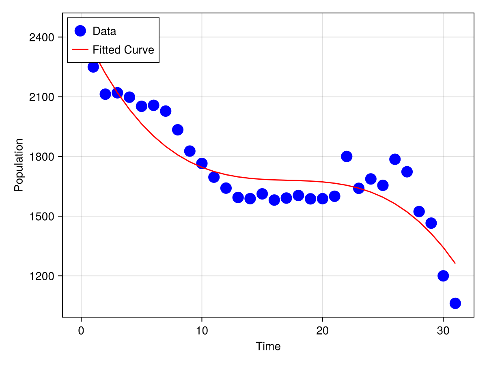

# Homework 4

**Note:** Submit your solutions in either `.md` (Markdown) or `.jl` (Julia) format.

1. **(Condition Number Analysis)** Classify each of the following matrices as well-conditioned or ill-conditioned by computing their condition numbers:

```math
\text{(a)} \quad \left(\begin{matrix}10^{10} & 0\\ 0 & 10^{-10}\end{matrix}\right)
```

```math
\text{(b)} \quad \left(\begin{matrix}10^{10} & 0\\ 0 & 10^{10}\end{matrix}\right)
```

```math
\text{(c)} \quad \left(\begin{matrix}10^{-10} & 0\\ 0 & 10^{-10}\end{matrix}\right)
```

```math
\text{(d)} \quad \left(\begin{matrix}1 & 2\\ 2 & 4\end{matrix}\right)
```

Answer:

```julia
julia> using LinearAlgebra

julia> A = [10^10 0; 0 10^-10]
2×2 Matrix{Float64}:
 1.0e10  0.0
 0.0     1.0e-10

julia> cond(A)
1.0e20

julia> B = [10^10 0; 0 10^10]
2×2 Matrix{Int64}:
 10000000000            0
           0  10000000000

julia> cond(B)
1.0

julia> C = [10^-10 0; 0 10^-10]
2×2 Matrix{Float64}:
 1.0e-10  0.0
 0.0      1.0e-10

julia> cond(C)
1.0

julia> D = [1 2; 2 4]
2×2 Matrix{Int64}:
 1  2
 2  4

julia> cond(D)
4.804857307547117e16
```

2. **(Solving Linear Equations)** Solve the following system of linear equations using Julia. Let $x_1, x_2, \ldots, x_5$ be real numbers:

```math
   \begin{align*}
   2x_1 + x_2 - x_3 + 0x_4 + x_5 &= 4, \\
   x_1 + 3x_2 + x_3 - x_4 + 0x_5 &= 6, \\
   0x_1 + x_2 + 4x_3 + x_4 - x_5 &= 2, \\
   -x_1 + 0x_2 + x_3 + 3x_4 + x_5 &= 5, \\
   x_1 - x_2 + 0x_3 + x_4 + 2x_5 &= 3.
   \end{align*}
```

Answer:
```julia
julia> A = [2 1 -1 0 1; 1 3 1 -1 0; 0 1 4 1 -1; -1 0 1 3 1; 1 -1 0 1 2]
5×5 Matrix{Int64}:
  2   1  -1   0   1
  1   3   1  -1   0
  0   1   4   1  -1
 -1   0   1   3   1
  1  -1   0   1   2

julia> b = [4, 6, 2, 5, 3]
5-element Vector{Int64}:
 4
 6
 2
 5
 3

julia> A \ b
5-element Vector{Float64}:
 -0.04651162790697683
  2.186046511627907
  0.30232558139534904
  0.8139534883720929
  2.2093023255813957
```

3. **(Polynomial Data Fitting)** Analyze the newborn population data in China and perform polynomial regression.

   **Dataset:** China's newborn population (1990-2021)
   - First column: Year
   - Second column: Population in 万 (×10⁴ people)

   ```text
   Year    Population (万)
   1990    2374
   1991    2250
   1992    2113
   1993    2120
   1994    2098
   1995    2052
   1996    2057
   1997    2028
   1998    1934
   1999    1827
   2000    1765
   2001    1696
   2002    1641
   2003    1594
   2004    1588
   2005    1612
   2006    1581
   2007    1591
   2008    1604
   2009    1587
   2010    1588
   2011    1600
   2012    1800
   2013    1640
   2014    1687
   2015    1655
   2016    1786
   2017    1723
   2018    1523
   2019    1465
   2020    1200
   2021    1062
   ```

   **Tasks:**
   - Fit the data using a third-degree polynomial: $y = a_0 + a_1 x + a_2 x^2 + a_3 x^3$
   - Create a plot showing both the original data points and the fitted curve
   - Use your model to predict the newborn population for 2024

   **Hint:** Consider shifting the x-axis (e.g., using years relative to 1990) to improve numerical stability and fitting quality.

   **Sample Code for Visualization:**

   ```julia
    using Makie, CairoMakie
    using Polynomials

    # Example data (replace with your actual population data)
    time = [0.0, 0.5, 1.0, 1.5, 2.0, 2.5, 3.0, 3.5, 4.0, 4.5]
    y = [2.9, 2.7, 4.8, 5.3, 7.1, 7.6, 7.7, 7.6, 9.4, 9.0]

    # Create figure and plot data points
    fig = Figure()
    ax = Axis(fig[1, 1], xlabel="Time", ylabel="Population")
    scatter!(ax, time, y, color=:blue, marker=:circle, markersize=20, label="Data")
    
    # Example polynomial fit (replace with your fitted coefficients)
    poly = Polynomial([1.0, 2.0, 3.0])  # Replace with your coefficients
    fitted_values = poly.(time)
    lines!(ax, time, fitted_values, color=:red, label="Fitted Curve")
    
    # Add legend and display
    axislegend(; position=:lt)
    fig  # Display figure
    save("population_fit.png", fig)  # Save plot
    ```

    Answer:
    denote $x$ as "year - 1990", and $y$ as population.

    the result is `y=2451.5802139037482 - 131.88430413372816*x + 7.607889485048778*x^2 - 0.1481152805949972*x^3`.

    predicted newborn population is `940.711129567608`.

    plot is shown below

    

    code to reproduce:
    ```julia
    julia> using LinearAlgebra, Polynomials, CairoMakie

   julia> x = collect(1990:2021) .- 1990;

   julia> y = [2374, 2250, 2113, 2120, 2098, 2052, 2057, 2028, 1934, 1827, 1765, 1696, 1641, 1594, 1588, 1612, 1581, 1591, 1604, 1587, 1588, 1600, 1800, 1640, 1687, 1655, 1786, 1723, 1523, 1465, 1200, 1062];

   julia> A = hcat(x.^0, x.^1, x.^2, x.^3);

   julia> Q, R = qr(A);

   julia> c = R \ (Matrix(Q)' * y);

   julia> fig = Figure();

   julia> ax = Axis(fig[1, 1], xlabel="Time", ylabel="Population");

   julia> scatter!(ax, x, y, color=:blue, marker=:circle, markersize=20, label="Data");

   julia> poly = Polynomial(c);

   julia> fitted_values = poly.(x);

   julia> lines!(ax, x, fitted_values, color=:red, label="Fitted Curve");

   julia> axislegend(; position=:lt);

   julia> save("population_fit.png", fig);
    ```

4. **(Extra points: Eigen-decomposition)** Solve the following problem:

    Consider a dual species spring chain, with the number of sites as large as possible. The mass is 1 on even sites and 2 on odd sites, and stiffness constant is $C = 1$. The boundary condition is periodic.
    - Show the density of states at different energy with binned bar plot. The $x$-axis is the energy, the $y$-axis is the population.
    - Compare with the result of the single species spring chain.

    Ref: the `hist` function in CairoMakie: https://docs.makie.org/dev/reference/plots/hist
